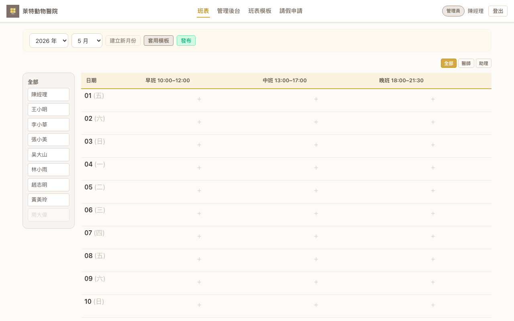
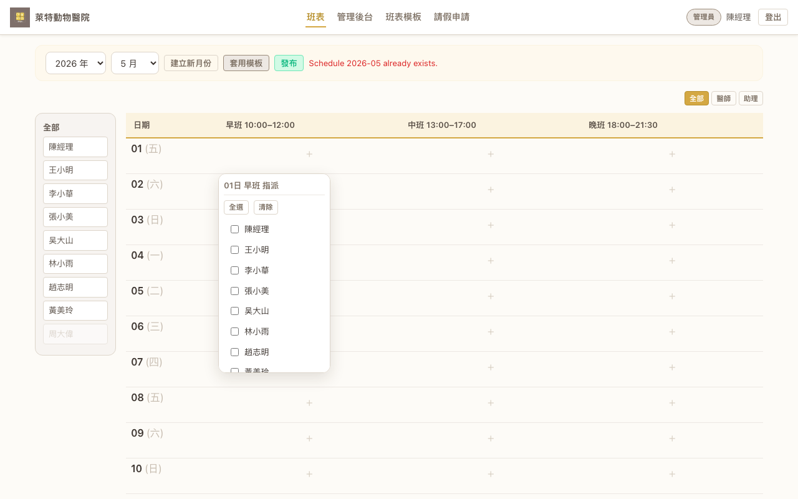
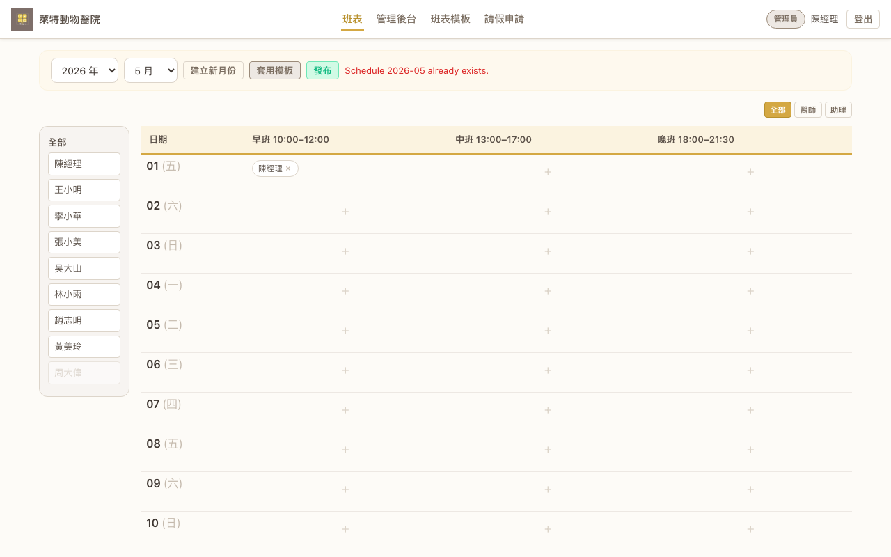
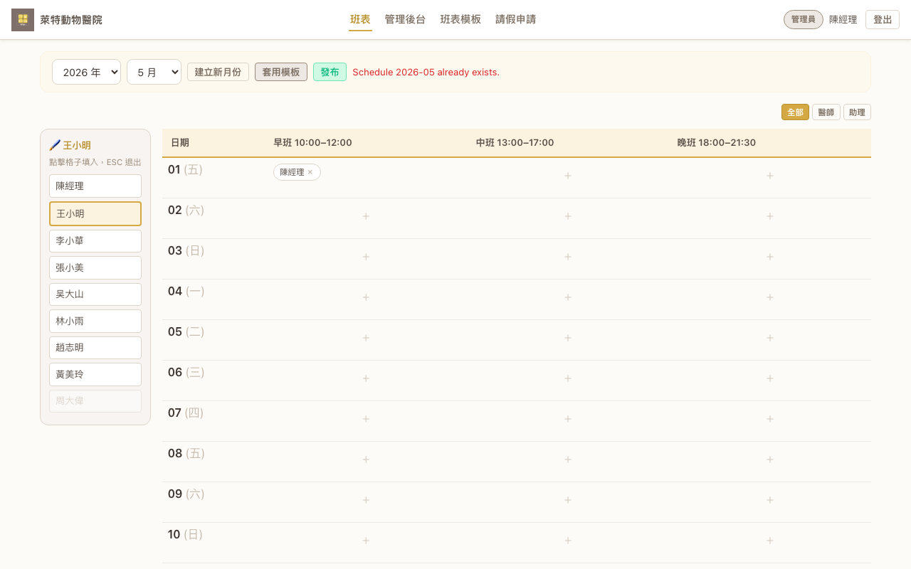
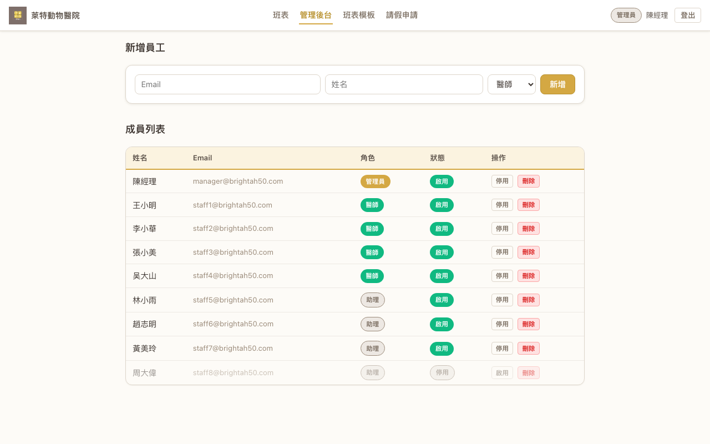
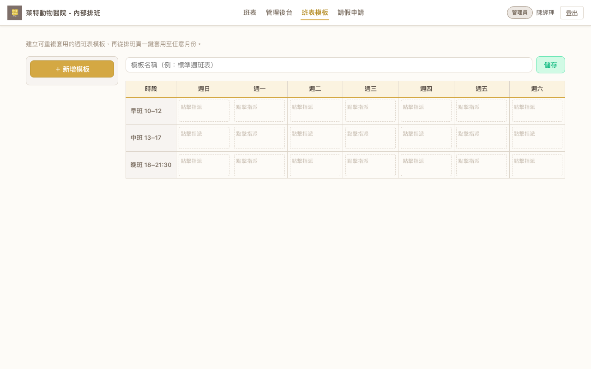
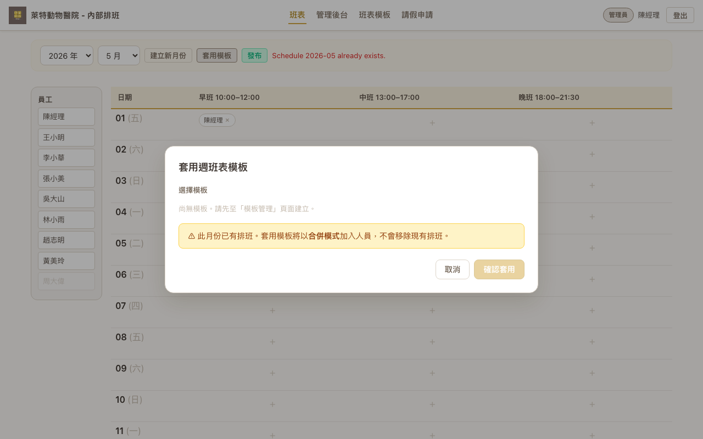

# 管理者操作手冊

> 本手冊適用對象：**醫院排班管理者**（院長、主管、負責排班的行政人員）。  
> 系統網址：https://brightah50-shift-master.web.app

---

## 目錄

1. [登入系統](#1-登入系統)
2. [管理班表](#2-管理班表)
   - [建立新月份](#21-建立新月份)
   - [逐格指派員工（快速指派）](#22-逐格指派員工快速指派)
   - [油漆桶模式（快速批量指派）](#23-油漆桶模式快速批量指派)
   - [職位篩選（醫師 / 助理）](#24-職位篩選醫師--助理)
   - [發布班表](#25-發布班表)
3. [員工管理](#3-員工管理)
   - [新增員工](#31-新增員工)
   - [停用員工](#32-停用員工)
   - [刪除員工](#33-刪除員工)
4. [週班表模板](#4-週班表模板)
   - [建立模板](#41-建立模板)
   - [套用模板至月份班表](#42-套用模板至月份班表)
5. [查看請假申請](#5-查看請假申請)
6. [常見問題](#6-常見問題)

---

## 1. 登入系統

1. 開啟瀏覽器，前往系統網址。
2. 點選「**使用 Google 登入**」按鈕。
3. 在 Google 彈出視窗中選擇您已授權的 Google 帳號，完成登入。

> ⚠️ 只有已在系統中註冊的 Google 帳號才能登入。若出現「帳號未授權」，代表您的帳號尚未被新增至系統白名單。

### 加入手機主畫面捷徑（選用）

將系統加入主畫面後，可像 App 一樣從桌面一鍵開啟，介面更簡潔（隱藏瀏覽器網址列）。

**iPhone / iPad（Safari）**

1. 用 **Safari** 開啟系統網址（`https://brightah50-shift-master.web.app`）。
2. 點選底部工具列的 `⋯` → **「分享」**。
3. 在分享選單中選擇「**加入主畫面**」。
4. 確認顯示名稱（建議改短為「萊特排班」），然後點選右上角「**加入**」。  
   若畫面出現「**打開為網頁 App**」選項，表示支援 PWA 完整功能（全螢幕、離線存取），直接點「加入」即可。

完成後，桌面將出現系統圖示，點一下即可進入排班系統。

> 移除方式：長按主畫面圖示 → 選擇「**刪除書籤**」。

---

## 2. 管理班表

### 2.1 建立新月份

1. 登入後，系統預設顯示「**班表**」頁面。
2. 使用頂部的「**年份**」和「**月份**」下拉選單，切換至目標月份。
3. 若該月份尚無資料，點選「**建立新月份**」按鈕即可建立。

建立完成後，會出現一個表格，欄位為：**日期** / **早班 10–12** / **中班 13–17** / **晚班 18–21:30**，每個時段的格子可點選指派。

---

### 2.2 逐格指派員工（快速指派）

1. 點選任一時段的空白格子（顯示 `+` 符號），會彈出「**快速指派**」面板。
2. 面板標題顯示「XX日 早班/中班/晚班 指派」，列出所有可指派員工。
3. **打勾** = 指派到該時段；**取消勾選** = 移除指派。
4. 也可使用面板頂部的「**全選**」、「**清除**」按鈕進行批量操作。
5. 按 `Esc` 或點選面板以外區域即可關閉。

指派完成後，員工名字會顯示在對應格子中（可按 `×` 移除）：

---

### 2.3 油漆桶模式（快速批量指派）

當需要將同一位員工指派到多個時段時，使用「油漆桶模式」可大幅加速。

1. 在班表頁面**左側員工列表**中，**點選一位員工的名字**。
2. 左上方會顯示「🔌 {員工名}」及提示「點擊格子填入，ESC 退出」，代表已進入油漆桶模式。
3. 直接**點選**任意時段格子，即可將該員工加入（再次點選同格則移除）。
4. 完成後按 `Esc` 或再次點選該員工名字退出。

> 💡 適合用於將固定人員排入整週或整月的特定時段。

---

### 2.4 職位篩選（醫師 / 助理）

班表右上角工具列提供職位篩選按鈕，可快速切換側邊欄員工列表的顯示範圍：

- **全部**：同時顯示醫師與助理（預設）。
- **醫師**：側邊欄僅顯示職位為「醫師」的員工。
- **助理**：側邊欄僅顯示職位為「助理」的員工。

> 篩選按鈕僅影響左側員工列表的顯示，不影響已排入班表的資料。

---

### 2.5 發布班表

班表編輯完成後，點選工具列的「**發布**」按鈕，醫師與助理即可在系統中看到該月份班表。

- 發布後，頁面會顯示綠色的「已發布」標示。
- 可隨時點選「**取消發布**」撤回（醫師與助理將看到「尚未發布」）。
- 發布後仍可繼續修改班表內容。

---

## 3. 員工管理

點選導覽列的「**管理後台**」，進入員工管理頁面。

### 3.1 新增員工

頁面上方為「**新增員工**」表單：

1. 輸入員工的 **Email**（必須是該員工的 Google 帳號信箱）。
2. 輸入員工的**姓名**。
3. 選擇**職位**：「醫師」、「助理」或「管理員」。
4. 按「**新增**」。

> 系統使用 Google 登入，不需要設定密碼。員工使用自己的 Google 帳號登入即可。

### 3.2 停用員工

- 成員列表中，點選該員工右側的「**停用**」按鈕。
- 停用後：該員工**無法登入**，且不會出現在排班指派清單中。
- 歷史班表中仍保留該員工的排班紀錄。
- 若需恢復，點選「**啟用**」按鈕即可。

### 3.3 刪除員工

- 點選「**刪除**」按鈕，系統會跳出確認對話框：「確定要刪除員工『{姓名}』嗎？刪除後此員工將無法登入且從列表消失，若要復原請重新新增。」
- 確認後，該員工將**從列表中消失**且無法登入。
- 歷史班表紀錄不受影響。若需復原，需重新新增該員工。

---

## 4. 週班表模板

模板功能讓您預先設定一週的標準排班，之後可一鍵套用至任意月份。

### 4.1 建立模板

1. 點選導覽列的「**班表模板**」。
2. 點選左側的「**＋ 新增模板**」按鈕。
3. 輸入模板名稱（例如「標準週班表」）。
4. 在 **7×3** 的表格中（欄：週日～週六、列：早班/中班/晚班），點選各格子指派員工。
5. 點選右上角「**儲存**」。

### 4.2 套用模板至月份班表

1. 前往「**班表**」頁面，切換到目標月份。
2. 點選工具列的「**套用模板**」按鈕，彈出「套用週班表模板」視窗。
3. 從下拉選單中選擇模板。
4. 按「**確認套用**」。

> ⚠️ 套用模板為**合併模式** — 會將模板中的人員加入現有班表，**不會**移除已排好的人員。

---

## 5. 查看請假申請

員工提報的「不可上班時段」會彙整在此頁面。

1. 點選導覽列的「**請假申請**」。
2. 使用年份/月份下拉選單篩選特定月份。
3. 管理者可查看**所有員工**的請假紀錄。
4. 可點選「**刪除**」移除某筆紀錄。

> 💡 建議排班前先查看此頁面，避免將員工排入其不可上班的時段。

---

## 6. 常見問題

**Q：無法登入，顯示「帳號未授權」？**  
代表您的 Google 帳號尚未在「管理後台」中被新增。請請求另一位管理者在系統中加入您的信箱。

**Q：員工說登入不了？**  
請檢查：(1) 該員工在「管理後台」中的狀態是否為「啟用」；(2) Email 是否與其 Google 帳號完全一致。

**Q：可以同時指派多位員工到同一個時段嗎？**  
可以。在快速指派面板中對多位員工打勾即可。

**Q：套用模板會覆蓋掉我已經排好的班表嗎？**  
不會。系統以**合併模式**套用 — 只增加不移除。

**Q：員工看到的班表和我看到的一樣嗎？**  
員工只能在班表**發布後**以唯讀模式查看。未發布時員工會看到「尚未發布」。

**Q：停用和刪除有什麼差別？**  
停用可隨時恢復（點擊「啟用」即可）；刪除後該員工從列表消失，需重新新增。兩者的歷史班表紀錄都會保留。
