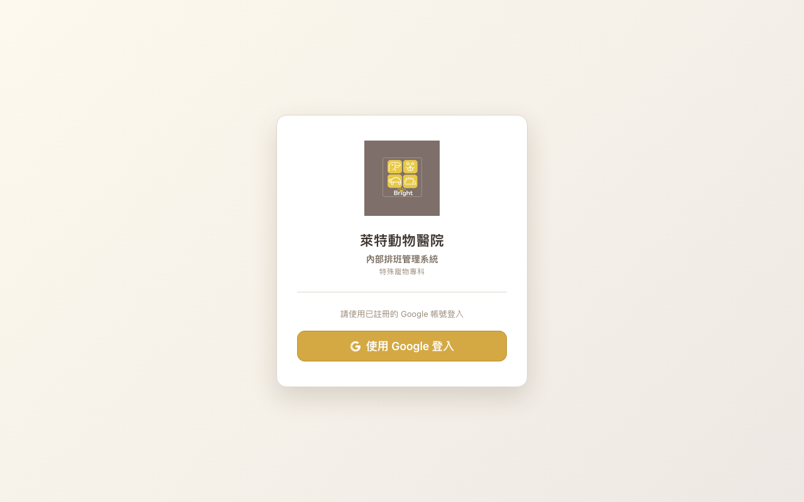
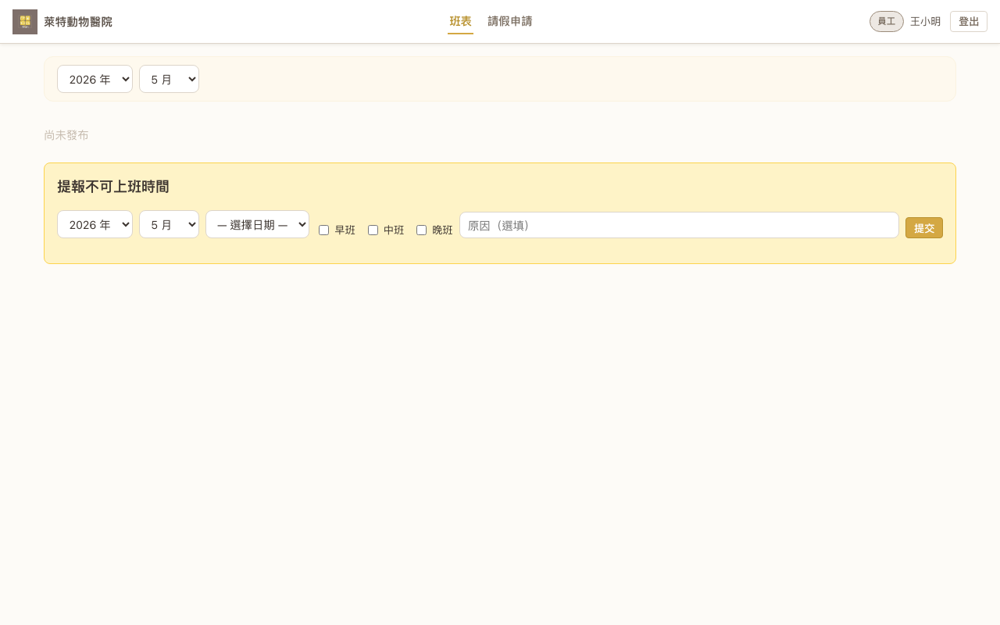
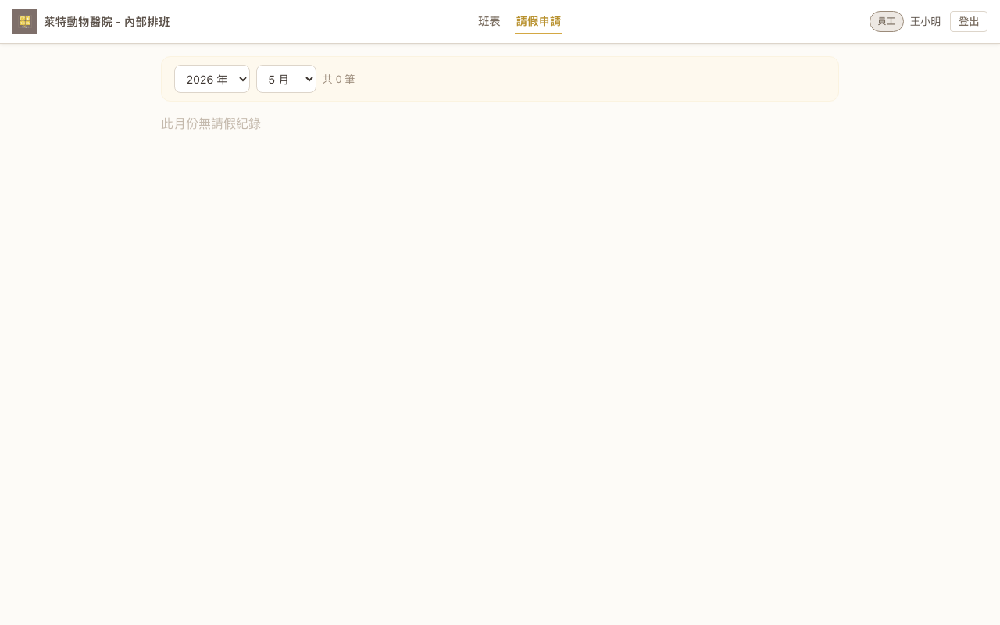

# 員工操作手冊

> 本手冊適用對象：**醫師、助理**（職位為 `doctor` 或 `assistant` 的非管理職人員）。  
> 系統網址：https://brightah50-shift-master.web.app

---

## 目錄

1. [登入系統](#1-登入系統)
2. [查看班表](#2-查看班表)
3. [提報不可上班時間](#3-提報不可上班時間)
4. [查看請假紀錄](#4-查看請假紀錄)
5. [常見問題](#5-常見問題)

---

## 1. 登入系統

1. 開啟瀏覽器，前往系統網址。
2. 點選「**使用 Google 登入**」按鈕。
3. 選擇您已經由管理者登記在系統中的 Google 帳號，完成登入。

> ⚠️ 您必須使用管理者在系統中設定的那個 Google 帳號信箱登入。若無法登入，請聯繫您的排班管理者確認帳號是否已新增。

### 加入手機主畫面捷徑（選用）

將系統加入主畫面後，可像 App 一樣從桌面一鍵開啟，介面更簡潔（隱藏瀏覽器網址列）。

**iPhone / iPad（Safari）**

1. 用 **Safari** 開啟系統網址（`https://brightah50-shift-master.web.app`）。
2. 點選底部工具列的 `⋯` → **「分享」**。
3. 在分享選單中選擇「**加入主畫面**」。
4. 確認顯示名稱（建議改短為「萊特排班」），然後點選右上角「**加入**」。  
   若畫面出現「**打開為網頁 App**」選項，表示支援 PWA 完整功能（全螢幕、離線存取），直接點「加入」即可。

完成後，桌面將出現系統圖示，點一下即可進入排班系統。

> 移除方式：長按主畫面圖示 → 選擇「**刪除書籤**」。

---

## 2. 查看班表

1. 登入後，系統預設顯示「**班表**」頁面。
2. 使用頂部的「**年份**」和「**月份**」下拉選單，切換至您想查看的月份。
3. 若該月份班表**已發布**，頁面會顯示完整的班表內容（唯讀，無法修改）。
4. 若該月份**尚未發布**，會顯示「尚未發布」提示，代表管理者尚未公布該月班表。

> 班表由管理者編排後發布，員工僅能查看、不能修改。

---

## 3. 提報不可上班時間

若您有特定日期/時段無法上班，可透過「提報不可上班時間」功能事先告知管理者。

在班表頁面下方的「**提報不可上班時間**」區塊：

1. 選擇**年份**和**月份**。
2. 從「選擇日期」下拉選單選擇具體**日期**。
3. 勾選不可上班的**班別**（可複選）：
   - ☐ 早班
   - ☐ 中班
   - ☐ 晚班
4. （選填）在「原因」欄位輸入原因。
5. 點選「**提交**」。

> 💡 建議盡早提報，方便管理者排班時參考。管理者在排班時可以看到您提報的不可上班時段。

---

## 4. 查看請假紀錄

點選導覽列的「**請假申請**」，可查看您過去已提交的所有不可上班紀錄。

1. 使用年份/月份下拉選單篩選特定月份。
2. 表格顯示您的所有紀錄，包含**日期**、**不可上班班別**、**原因**等資訊。
3. 若需要撤銷某筆紀錄，可點選右側的「**刪除**」。

---

## 5. 常見問題

**Q：無法登入？**  
請確認：(1) 您使用的是管理者登記的那個 Google 帳號；(2) 您的帳號未被停用。若仍有問題，請聯繫排班管理者。

**Q：為什麼班表顯示「尚未發布」？**  
代表管理者尚未發布該月份的班表。請耐心等待，或詢問管理者預計何時發布。

**Q：我可以修改班表嗎？**  
不行。班表由管理者統一編排，員工僅能查看。如果您有排班問題，請直接與管理者溝通。

**Q：提報不可上班時間後，管理者一定會配合嗎？**  
您的提報會作為管理者排班的**參考**。最終班表仍由管理者決定。若有排入您不可上班的時段，請與管理者確認。

**Q：可以刪除已經提交的不可上班紀錄嗎？**  
可以。在「請假申請」頁面找到該筆紀錄，點選「刪除」即可撤銷。
